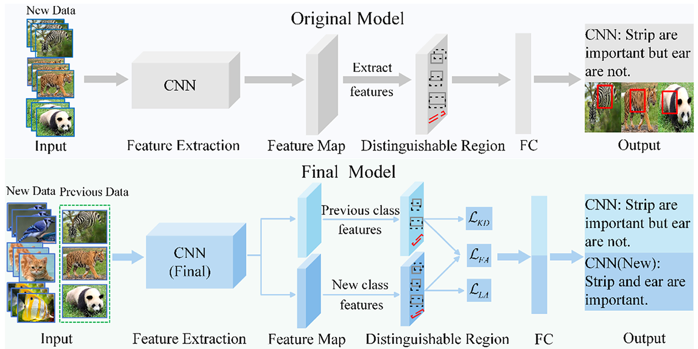
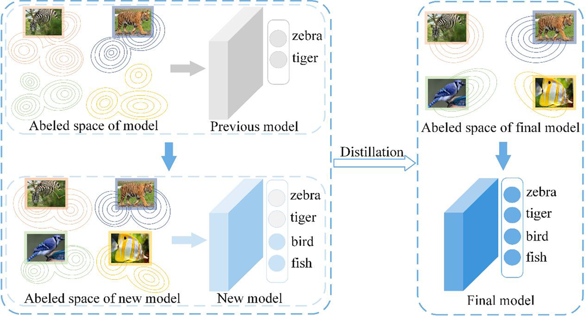

# Feature-Compatible Embeddings
This is the official PyTorch code for the paper:

**A Class-Incremental Learning Approach for Learning Feature-Compatible Embeddings.**

**Hongchao An**, **Jing Yang***,  **Xiuhua Zhang**,  **Yuankai Wu**,  **Xiaoli Ruan**, **Shaobo Li**, **Jianjun Hu**

**This is the overall methodology diagram of the paper:**

Fig. 1. FCE. More compatible embedding between the features of new and previous classes can be obtained by freezing the previous model and extending a new
module.
<p align="center">
  
</p>

Fig. 2. Fusion knowledge distillation. Removing the redundant feature dimensions resulting from extending the new modules in the first stage constrains the new
and previous class features of the model to the plastic space and motivates the model to produce compatible embeddings between the features of the new and
previous classes.
<p align="center">
  
</p>

## Prerequisites
The following packages are required to run the scripts:

- [torch](https://github.com/pytorch/pytorch)
- [torchvision](https://github.com/pytorch/vision)
- [tqdm](https://github.com/tqdm/tqdm)
- [numpy](https://github.com/numpy/numpy)

## Training scripts

Train CIFAR-100: ``` python main.py --config=./hyperparameter/b50inc10.json ```

Train ImageNet:  ``` python main.py --config=./hyperparameter/foster-imagenet100.json or python main.py --config=./hyperparameter/foster-imagenet1000.json ```


**The complete code will be uploaded after the paper is accepted.**

